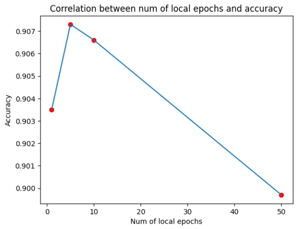
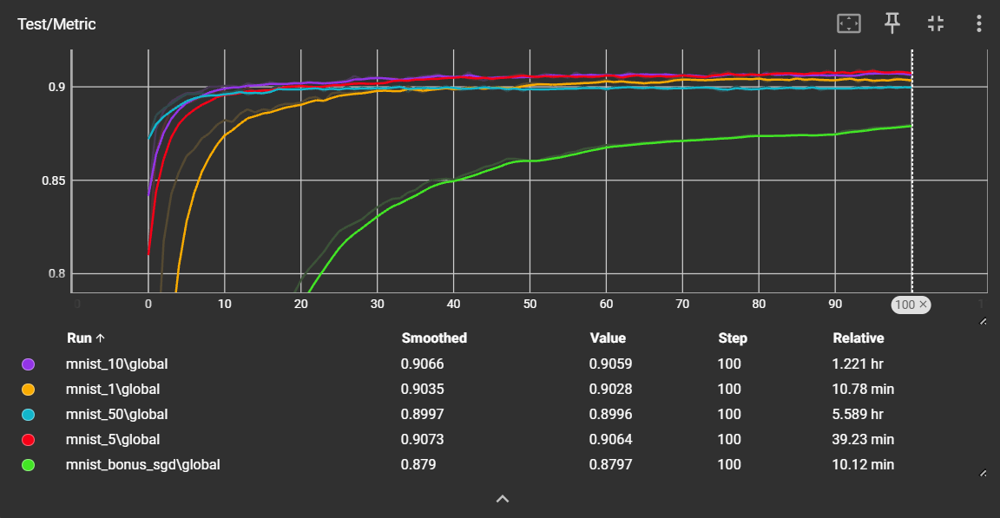

# Federated Learning & Data Privacy, 2025-2026

## First Lab - 25 September 2025

### EXERCISE 1 - Get Familiar with the Code

  **UML Diagram**:

---

### EXERCISE 2 - Complete the Code

**Objective**: Understand the core mechanics of FedAvg by implementing the missing code.

**Done**
---

### EXERCISE 3 - The Effect of Local Epochs

**Objective**: Analyze how the number of local epochs affects the model's performance in a federated learning setting.

- **Experiment**:
  - Run FedAvg for different numbers of local epochs. Here, I ran the FedAvg with the local epochs are: `1, 5, 10, 50`. 
  - Record the test accuracy for each setting.

- **Plot**:
  - Create a plot with the local epochs on the x-axis and test accuracy on the y-axis.

  - Interpret the plot and draw your conclusions. How does the number of local epochs influence the learning process and the final model accuracy? Were you expecting this result? Motivate your answer.  

- **Answer**:
When we increased the number of local epochs per client, the model converged more quickly toward the optimal point. Specifically, the curve for `1 local epoch` converged slower compared to larger local epochs: `5,10,50 local epoch`. In terms of accuracy, performance improved as we increased the local epochs from `1` to `5` or `10` local epochs, but it declined when training with `50` local epochs. Overall, increasing the number of `local epochs` accelerates convergence, but does not always lead to better accuracy. Therefore, the choice of `local epochs` acts as a **hyperparameter** that must be carefully tuned to balance model performance and computational efficiency.

- **Bonus**: Set the batch size equal to the dataset size, and the number of local epochs to 1. This will reduce to running FedSGD algorithm. Test the algorithm and comment the results.
  - The green curve on the above figure is the curve of **FedSGD algorithm**, we can see that the curve slower converged, and the accuracy is not good as the **FedAvg algorithm**.

---

