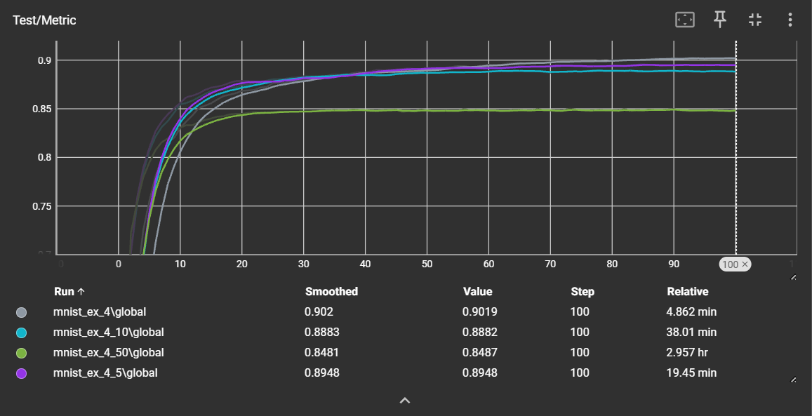
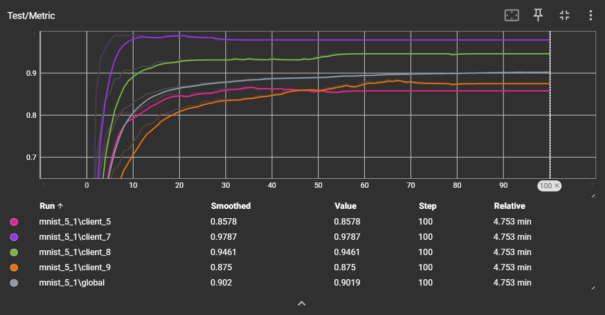

# Federated Learning & Data Privacy, 2025-2026

## Second Lab - 09 October 2025

### RECAP OF EXERCISE 3 - The Effect of Local Epochs

**Analysis**:
- Discuss how local epochs influence model accuracy. 
- Were you expecting this result? 
- How was the data generated and partitioned in TP1? Justify your answer by examining `data/mnist/generate_data.py` and `data/mnist/utils.py`.

**Answer**:
- When we increased the number of local epochs per client, the model converged more quickly toward the optimal point. Specifically, the curve for `1 local epoch` converged slower compared to larger local epochs: `5,10,50 local epoch`. In terms of accuracy, performance improved as we increased the local epochs from `1` to `5` or `10` local epochs, but it declined when training with `50` local epochs. 
- Increasing the number of `local epochs` can accelerate convergence but does not always lead to better accuracy.  
Since each client focuses only on its **local optimum** and is unaware of the **global optimum**, too many `local epochs` cause clients to overfit to their local solutions.
When the server aggregates and averages these parameters, the **global model** may temporarily move closer to the **global optimum**.  
However, after sending the updated parameters back, each client again gravitates toward its **local optimum**, repeating the cycle and preventing true convergence to the **global optimum**.
- The training dataset is randomly selected as a fraction (`frac`) of the MNIST dataset. It is then shuffled and **IID-divided** according to the **number of clients**.  
Finally, the data is split into training and testing sets based on the `n_train_samples` parameter.

---

## NEW EXERCISES FOR TP2

### EXERCISE 4 - The Impact of Data Heterogeneity

**Objective**: Demonstrate that an increase in the number of local epochs can potentially degrade FedAvg’s performance under non-IID data distributions.

- **Preliminary question**: What non-IID data distribution means? Provide examples.
    - **Answer**: non-IID data means the data don’t all come from the same probability distribution or aren’t statistically independent of each other.
        - *Non-Identical Distribution*: Different data sources (clients, users, hospitals, etc.) have different data distributions.

            Example: In a federated medical dataset: Hospital A has mostly elderly stroke patients, Hospital B has mostly young trauma patients and Hospital C has balanced demographics.
        - *Non-Independence*: Samples are correlated and they influence each other.
        
            Example: Stock prices today depend on prices yesterday. All the time series data are not independence.

- **Pathological Split**: Familiarize yourself with the concept of “pathological split” as explained in [Communication-Efficient Learning of Deep Networks from Decentralized Data (Section 3)](https://arxiv.org/abs/1602.05629). The `pathological_non_iid_split` function has been implemented for you in `data/mnist/utils.py`. Review this method and summarize it briefly.
    - **Answer**: Instead of randomly splitting the dataset among clients, the data is first **sorted by label** and then divided into `n_clients * n_classes_per_client` equally sized shards.  Each client is assigned `n_classes_per_client` shards, ensuring that it has data from at most two classes and no information about the others. This method simulates the **Non-Identical Distribution (Non-IID)** commonly seen in real-world client datasets.

- **Experiments**: Run the `generate_data.py` script with the `--non_iid` flag and set `--n_classes_per_client=2` to partition the MNIST dataset in a non-IID fashion. 
- **Plot**: Run experiments to observe how varying the number of local epochs (e.g., 1, 5, 10, 50) influences the model's test accuracy under non-IID data distribution. Plot the relationship between the number of local epochs and test accuracy.

- **Interpretation**: Briefly comment the results. Were these results expected?

    **Answer**: 
    - Using the same **FedAvg** method as in *TP1*, the best accuracy is slightly lower (**0.902** vs. **0.907**).  
    However, an interesting difference emerges: while *TP1* achieved its best result with `5 local epochs`, this experiment reached the highest accuracy with only `1 local epoch`.

    - The reason lies in the **Non-IID** nature of the dataset.  Since client data distributions differ, their local models behave inconsistently — for example, they converge to their **local optima** at different speeds.  
    As a result, when clients train too long on their own data, the **global model** performance degrades.

---

## EXERCISE 5 - Client Sampling

**Objective**: Implement two client sampling strategies from the research paper ["On the Convergence of FedAvg on Non-IID Data"](https://arxiv.org/abs/1907.02189).

### EXERCISE 5.1 - Uniform Sampling Without Replacement

#### Background
Understand uniform sampling as described in Assumption 6. This involves selecting a subset of clients $|S_t| = K$ at each round without replacement. Understand the aggregation formula given by $w_t \leftarrow \frac{N}{K} \sum_{k \in S_t} p_k w^k_t$.

#### Instructions
1. In `aggregator.py`, complete the `sample_clients()` method to uniformly sample `self.n_clients_per_round` clients from the total available clients.
2. Use `self.rng.sample` to sample `self.n_clients_per_round` unique ids from a population ranging from 0 to `self.n_clients - 1`.
3. Assign the list of sampled ids to `self.sampled_clients_ids`.
4. Modify the `mix()` method to:
    - Use only the sampled clients for training. For local training, loop over `self.sampled_clients_ids` instead of all clients.
    - Aggregate updates from the sampled clients. Adjust weights accordingly.
   
**The code is completed!!**

**Run the code**

Run the `train.py` script with `sampling_rate = 0.2`.

### EXERCISE 5.2 - Sampling With Replacement

#### Background
Understand sampling with replacement according to sampling probabilities $p_1, \dots, p_N$. The aggregation formula adjusts to $w_t \leftarrow \frac{1}{K} \sum_{k \in S_t} w^k_t$.

#### Instructions
1. Extend the `sample_clients()` method to support sampling with replacement based on `self.sample_with_replacement` flag.
2. If `self.sample_with_replacement` is True, use `self.rng.choices` to sample clients based on their weights `self.clients_weights`.

**The code is completed!!**

**Run the code**

Run the `train.py` script with `sampling_rate = 0.2` and `sample_with_replacement = True`.

---

## EXERCISE 6 - Algorithms

### EXERCISE 6.1 - Tackling Data Heterogeneity with FedProx

**Objective**: Understand how the FedProx algorithm addresses the challenges posed by data heterogeneity in federated learning and compare its performance with the FedAvg algorithm.

- **FedProx Overview**: FedProx is a Federated Learning algorithm that modifies the local training objective by introducing a proximal term, which aims to reduce local model drift by penalizing significant deviations from the global model. Review the FedProx algorithm [Federated Optimization in Heterogeneous Networks (Algorithm 2)](https://arxiv.org/abs/1812.06127) and our implementation of the ProxSGD class in `utils/optim.py`.

- **Experiments**: To initiate FedProx experiments, run the `train.py` script with `local_optimizer = "prox_sgd"` and set the proximal term coefficient `mu = 2`.
- **Plot**: Replicate the plot from Exercise 4, this time evaluating FedProx algorithm.

- **Analysis**: Discuss the observed differences in performance between FedAvg and FedProx. 
    - Explain the motivation behind FedProx and what are the potential advantages compared to FedAvg.
    - Are there specific configurations (e.g., number of local epochs) where FedProx particularly outperforms FedAvg?

    - **Answer**:
        - As we can see from the figures of evaluating performance of 2 method **FedAvg** and **FedProx**, **FedAvg** outperformed **FedProx** for all number of `local epochs`.
        
        - Motivation behind FedProx: The main motivation for FedProx is to address the two major types of heterogeneity that occur in real-world federated learning environments. 
            - Systems heterogeneity – Devices in a federated network (phones, IoT devices,...) have different computation power, network conditions, and energy constraint.
            - Statistical heterogeneity – The data across devices are non-IID (not identically distributed).
        - The potential advantages compared to FedAvg: 
            - FedProx allows devices to perform different amounts of local computation, enabling participation of slower devices rather than discarding them.
            - Better stability under non-IID data, because **FedProx** has **the proximal term** penalizes local models for drifting too far from the global model.
            - Unlike FedAvg, FedProx comes with theoretical convergence guarantees even when data are non-IID and devices perform variable amounts of local work.
        - In this experiment, the dataset is relatively simple compared to the one used in the original paper.  Additionally, the model architecture includes only a **LinearLayer**, which limits the ability of **FedProx** to demonstrate its expected **stability advantage** over **FedAvg**. Furthermore, this setup simulates clients with equal computational power and identical amounts of local work, eliminating one of the main challenges that **FedProx** is designed to handle.
---

---

At the end of the lesson, you can send your answers and code to: [francesco.diana@inria.fr](mailto:francesco.diana@inria.fr)